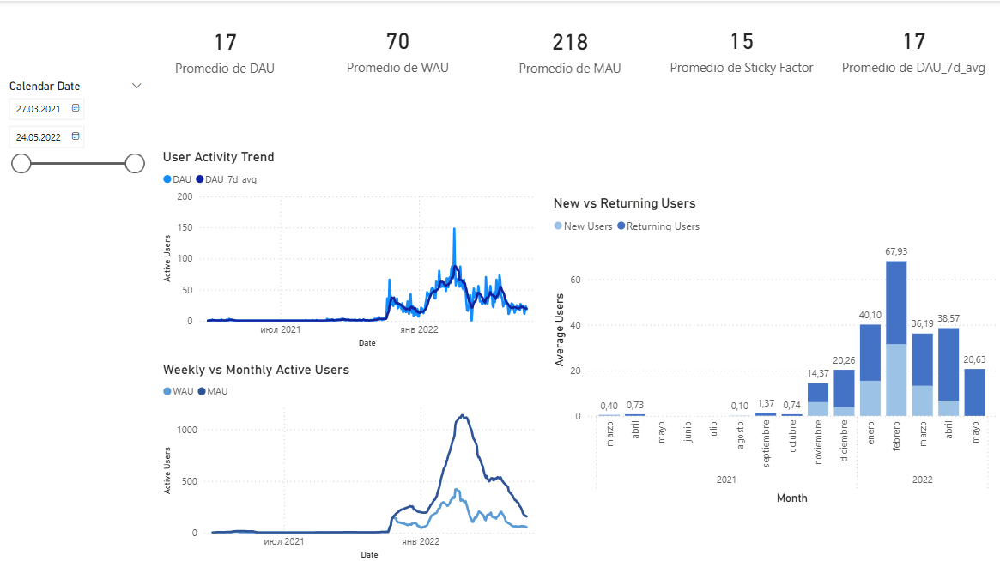
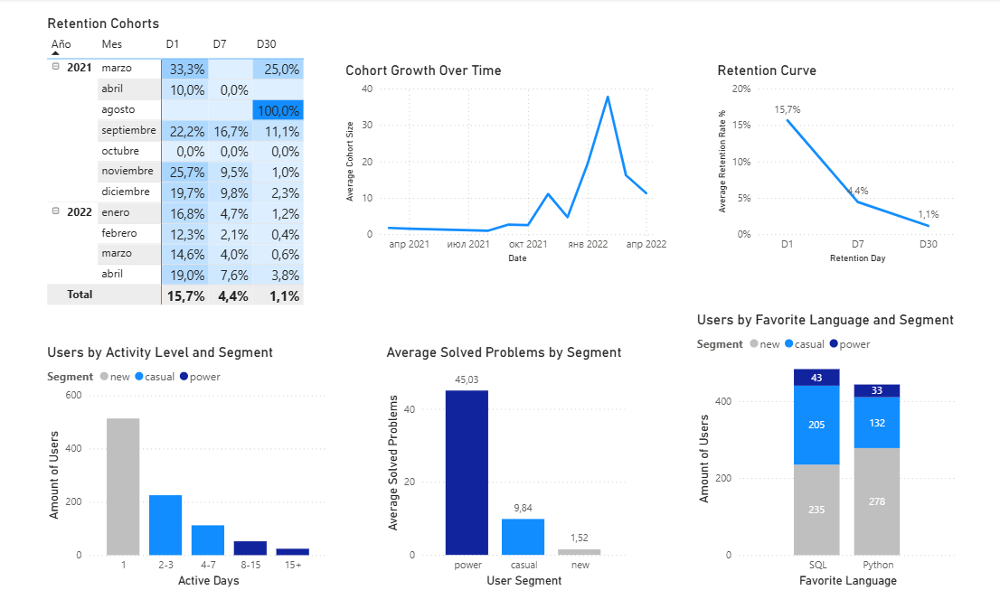
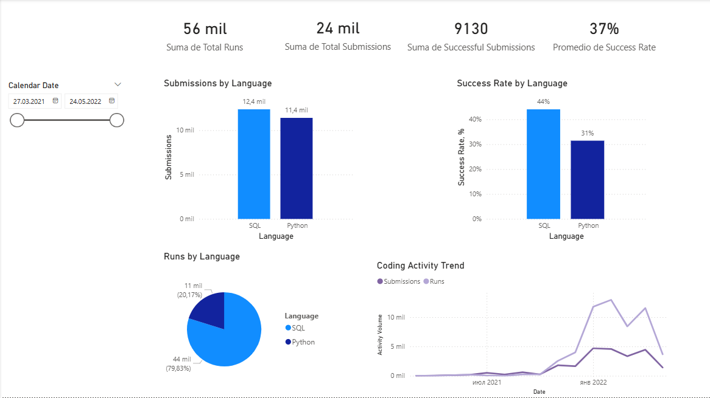

# Learning Platform Product Analytics

End-to-end analytics project simulating a real-world product analytics workflow for an educational coding platform.

The project reproduces a typical product analytics process by transforming normalized platform events into analytical datasets and interactive dashboards using PostgreSQL and Power BI.

The analysis is based on a locally deployed copy of an educational database provided by Simulative School for Data Analysts as part of its learning resources.

---

## Project Overview

The project analyzes user engagement, retention and learning behavior on a simulated online coding platform.

Main analytical areas:
- User engagement metrics
- Retention analysis
- Learning activity monitoring
- Behavioral segmentation
- Coding activity analysis

The project simulates a real-world product analytics workflow:

Raw events > analytical marts > BI dashboards > business insights

---

## Business Objectives

- Measure platform engagement using DAU, WAU, MAU and Sticky Factor
- Analyze user retention using cohort metrics
- Monitor coding activity and language popularity
- Explore behavioral differences between users segments
- Build analytical marts for BI reporting

---

## Tech Stack

- PostgreSQL
- DBeaver
- Power BI
- Git / GitHub

---

## Documentation

Detailed project documentation:
- docs/data_model.md
- docs/metrics_definition.md

---


## Dashboard Pages

### Overview



---

### Retention & Behavior



---

### Learning Activity



---

## Key Insights

### Platform Growth

Platform activity remained extremely low between March 2021 and October 2021.

DAU, WAU and MAU started increasing significantly after October 2021, indicating platform growth and increased user acquisition.

Average engagement metrics:
- DAU = 17
- WAU = 70
- MAU = 218

Average Sticky Factor:
15%

---

### Retention

Retention decreased substantially over time:
- D1 = 15.7%
- D7 = 4.4%
- D30 = 1.1%

The results indicate strong early churn and very limited long-term engagement.

Only around 10% of users accumulated at least seven active coding days.

---

### Learning Behavior

New users showed slightly higher preference for Python:
- Python = 278
- SQL = 235

However, more engaged users demonstrated stronger SQL activity.

Casual users:
- SQL = 205
- Python = 132

Power users:
- SQL = 43
- Python = 33

Power users solved nearly:
- 30 times more problems than new users
- 5 times more problems than casual users

---

### Coding Activity

Users generated:
- 56k code runs
- 24k submissions

Average success rate:
37%

SQL generated approximately 80% of all runs.

---

### SQL vs Python

SQL and Python generated similar submission volumes:
- SQL = 12.4k
- Python = 11.4k

However, SQL users produced significantly more execution events:
- SQL = 44k runs
- Python = 11k runs

This may indicate that SQL users validated solutions more frequently before submission, potentially contributing to higher success rates.

Success rate:
- SQL = 44%
- Python = 31%

This higher acceptance rate among SQL users may also suggest lower task complexity or stronger learner proficiency.

---

## Repository Structure

```text
learning-platform-product-analytics/
│
├── sql/
│   ├── 01_dim_calendar.sql
│   ├── 02_dim_users.sql
│   ├── 03_fact_daily_user_activity.sql
│   ├── 04_agg_daily_platform_kpis.sql
│   ├── 05_agg_user_retention.sql
│   ├── 06_agg_problem_activity.sql
│   └── 07_agg_user_learning_behavior.sql
│
├── dashboard/
│   └── learning_platform_dashboard.pbix
│
├── images/
│   ├── overview.png
│   ├── retention_behavior.png
│   └── learning_activity.png
│
├── docs/
│   ├── data_model.md
│   └── metrics_definition.md
│
└── README.md
```
